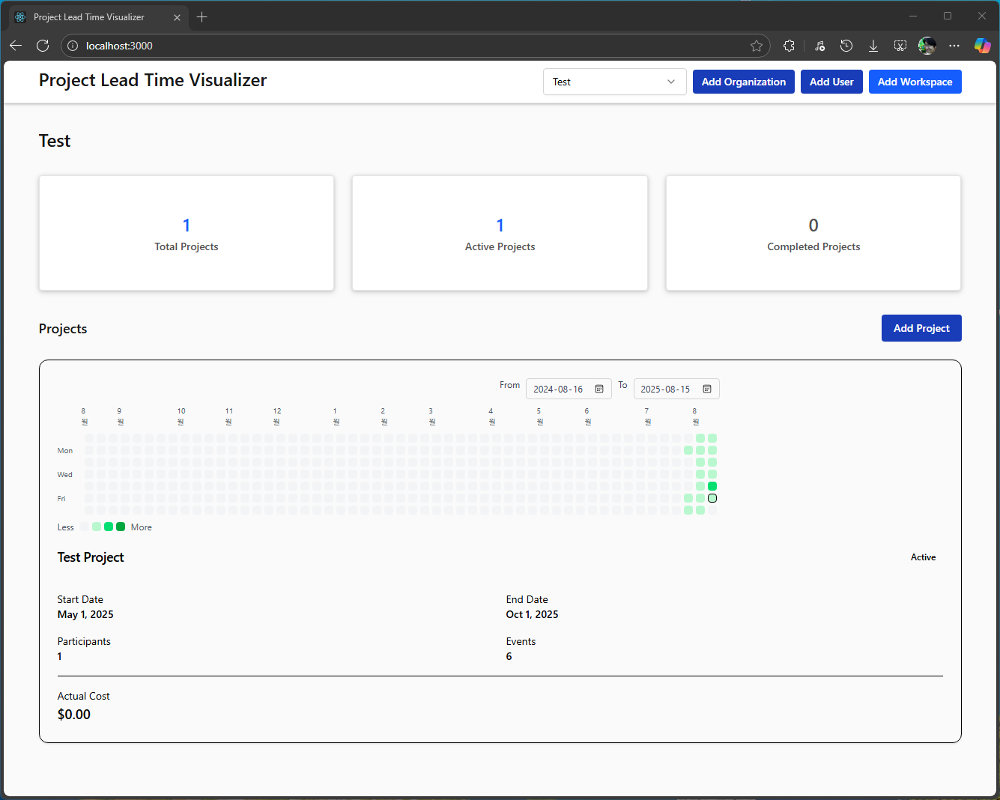
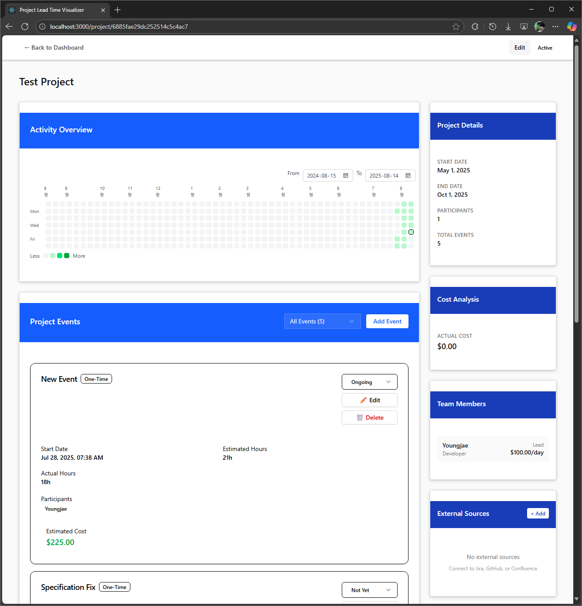

# project-lead-time-visualizer

## Introduction

This project aims to visualize the lead time of projects by integrating data from Confluence, GitHub and Jira. 
The goal is to provide insights into the time taken for various stages of project development, from planning to deployment.

This is my personal project to learn about data visualization, Express backend and Vite frontend development.

## Features
- Visualize lead time of projects
- Display project details and lead time in a user-friendly interface
- Calculate budget and actual costs
- Integrate with Confluence, GitHub and Jira to fetch data

## To-Do List
[v] Add model
[v] Add frontend and backend skeleton
[ ] Add Confluence reader
[ ] Add GitHub reader
[ ] Add Jira reader

